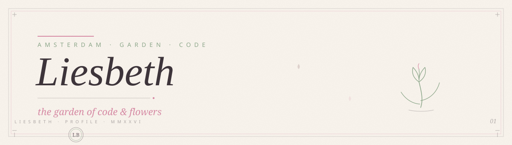

  

 

  <em>gardener · maker · amsterdam</em>

  

 

  
  <h2>about</h2>

The garden is my IDE. I plant small repositories, water them with coffee, 
and let them bloom at their own pace. 
Weekends are for scones and flower markets; weekdays, for clean commits 
and kind code reviews.

 

  
  <h2>toolbox</h2>

  
  
  
  
  
  

 

  
  <h2>garden data</h2>

  
  

 

  
what I'm growing

   
  🌱 a cozy profile README 
  🍰 a weekend recipe book

 
 

  
   
  thanks for visiting my little garden — liesbeth 🌷

