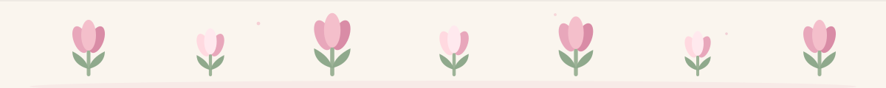

  

 

  <em>gardener · maker · amsterdam</em>

  

 

  
  <h2>about</h2>

The garden is my IDE. I plant small repositories, water them with coffee, 
and let them bloom at their own pace. 
Weekends are for scones and flower markets; weekdays, for clean commits 
and kind code reviews.

| 🌷 tulip daydreamer | ☕ pour-over rituals | 🍰 weekend baker | 🪴 plant parent |
| :---: | :---: | :---: | :---: |
| *slow mornings* | *single origin* | *scones & tarts* | *all alive* |

 

  
  <h2>featured</h2>

  

 

  
  <h2>toolbox</h2>

  
  
  
  
  
  

 

  
  <h2>garden data</h2>

  
  

  

 

  
  <h2>garden journal</h2>

- [x] plant a profile README 🌷
- [x] water it with coffee ☕
- [ ] let a tiny [test](https://github.com/liesbethbelmokhtar203-source/test) seed grow into something real 🌱

 

  
   
  thanks for visiting my little garden — liesbeth 🌷

